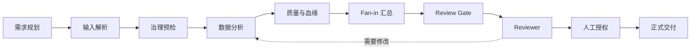

<p align="center">
  
</p>

<h1 align="center">Analytica</h1>

<p align="center">
  本地优先、可审计、受治理的数据分析 Agent 工作台
</p>

Analytica 把需求理解、多模态解析、数据入仓、分析执行、Review Gate、Reviewer 和正式交付组织为一条可观察的图执行链。每次运行都会保留节点状态、Artifact 引用、事件轨迹和治理决策，便于复算、审查和恢复。

> 当前仓库处于活跃开发阶段。核心实现位于 Pi agent harness 之上的 Analytica 扩展层；部分能力由 Feature Profile 控制，默认不会全部启用。

## 核心能力

| 能力 | 说明 |
| --- | --- |
| Requirement Agent | 将业务请求转为结构化需求卡、约束、澄清问题和可执行计划 |
| Multimodal Agent | 解析图片、图表、PDF、DOCX、PPTX、XLSX、HTML、CSV 等输入，并区分已验证事实与不确定声明 |
| Data Analysis Agent | 在隔离上下文中生成分析计划和脚本，执行 KPI、分组、趋势、Top-N、统计分析与可视化 |
| Data Governance | 管理 WriteGate、质量检查、Snapshot、Lineage、训练数据适用性和写入边界 |
| Reviewer | 基于不可变 Artifact、Manifest 和 ReviewGate 决策检查分析结果，阻止未授权交付 |
| Graph Runtime | 以事件溯源方式调度节点、Artifact 依赖、重试、反馈环和人工授权 |
| Web UI | 中文浅色工作台，提供会话、数据集、报告、图运行、Artifact、工具和设置页面 |

## 业务执行链



图中的控制依赖和 Artifact 传递是两类独立边。失败、重试、版本升级和人工动作写入追加式事件流，恢复时会重新校验 Graph、Feature Snapshot 和 Artifact Hash。

## Web UI

Web UI 采用无构建 SPA 和只读适配服务器。它读取真实的 Graph Run、Agent Loop、Artifact Linkage、分析报告和 Feature Registry；除会话消息外，不直接写 Artifact，也不绕过 WriteGate、ReviewGate 或 Reviewer。

```bash
node --experimental-strip-types \
  packages/coding-agent/examples/extensions/multimodal-artifact-poc/web/server.mts \
  --port 4775
```

打开 [http://127.0.0.1:4775](http://127.0.0.1:4775)。默认会加载仓库内的确定性演示运行；可通过 `ANALYTICA_WEB_CWD` 指向其他工作目录。

## 快速开始

### 1. 准备 Node 环境

要求 Node.js `>=22.19.0`。

```bash
npm install --ignore-scripts
npm run check
```

### 2. 启动 Analytica 扩展

```bash
FEATURE_RUNTIME_PROFILE=all-enabled \
./pi-test.sh \
  -e packages/coding-agent/examples/extensions/multimodal-artifact-poc
```

完整能力还需要按需配置模型 Provider、OCR/文档解析器和 Lakehouse Gateway。默认配置遵循 fail-closed：未启用或未配置的能力不会伪装为成功。

### 3. 可选：启动本地 Lakehouse Gateway

```bash
cd packages/coding-agent/examples/extensions/multimodal-artifact-poc/services/lakehouse-gateway
LAKEHOUSE_MODE=local python3 -m uvicorn app.main:app --port 8001
```

随后设置：

```bash
export LAKEHOUSE_GATEWAY_URL=http://127.0.0.1:8001
```

Pipeline 的写路径只由显式 CLI/E2E 入口触发，不注册为普通 Agent 工具。

## 主要目录

```text
packages/coding-agent/examples/extensions/multimodal-artifact-poc/
├── index.ts                  # Analytica 扩展入口与工具注册
├── src/graph-engine/         # 图编译、调度、事件存储、反馈与人工门
├── src/requirement-planning/ # 需求卡、路由、约束和计划
├── src/data-analysis/        # 隔离分析 Agent、计划和脚本执行
├── src/reviewer/             # ReviewGate、Reviewer、Replay 和 Verdict
├── src/pipelines/            # Batch / Streaming / Hybrid Pipeline
├── services/                 # Lakehouse Gateway 与确定性治理服务
├── web/                      # 中文 Web UI 与只读适配服务器
└── docs/                     # 架构、契约、安全边界和运行手册

evaluation/
├── run-full-evaluation.sh    # 一键冻结评测入口
└── one-click-evaluation/     # 28 项指标编排器与说明
```

## 评测

免费预检不会调用模型：

```bash
./evaluation/run-full-evaluation.sh --dry-run
./evaluation/run-full-evaluation.sh --preflight
```

完整评测会创建隔离 worktree 和独立证据目录，冻结 Commit、模型、配置、数据 Hash、Golden Answer 与评分契约：

```bash
./evaluation/run-full-evaluation.sh
```

评测覆盖 Agent 任务成功率、工具调用、约束召回、多模态结构化抽取、数值正确性、Pipeline、数据质量、Reviewer、硬门禁、端到端耗时和可观察 Token 用量。基础设施失败与业务失败分开记录。

## 开发与验证

```bash
npm run check   # lint、格式、类型、依赖和浏览器 smoke check
./test.sh       # 非 E2E 测试
```

各子系统还提供针对性的 TypeScript、Python、Gateway 和 Graph E2E 测试。具体命令见扩展目录下的 [README](packages/coding-agent/examples/extensions/multimodal-artifact-poc/README.md) 与 [Graph Runbook](packages/coding-agent/examples/extensions/multimodal-artifact-poc/docs/GRAPH_ENGINEERING_RUNBOOK.md)。

## 安全与治理边界

- 原始图片和文档不会直接进入纯文本模型上下文，只传递结构化结果或摘要。
- 复杂分析在隔离子 Agent 与受控脚本工作区中执行，主 Agent 不负责重写数值结果。
- 写入、Promotion 和正式交付必须经过对应治理节点；缺失证据时拒绝放行。
- Artifact 使用内容 Hash、来源节点和运行版本绑定，Reviewer 检查不可变产物而非模型自述。
- 本项目本身不提供操作系统级权限沙箱。生产使用时仍应配置容器、进程隔离和最小权限凭据。

安全问题请参考 [SECURITY.md](SECURITY.md)。

## Project ownership and provenance

Analytica is independently maintained and directed by
[@lzzzhh](https://github.com/lzzzhh).

The project contains substantial original development and modifications,
together with components distributed under their applicable open-source
licenses. Existing copyright notices and license terms are preserved.

Repository ownership and maintenance responsibility do not erase the
authorship of earlier or external contributions.

Analytica includes components derived from the MIT-licensed Pi agent harness. Upstream package names, third-party notices, and vendored component licenses are retained where applicable.

## License

本仓库按 [MIT License](LICENSE) 分发。第三方和 vendored 组件可能包含各自的许可证文件；使用相关组件时应同时遵守对应条款。
